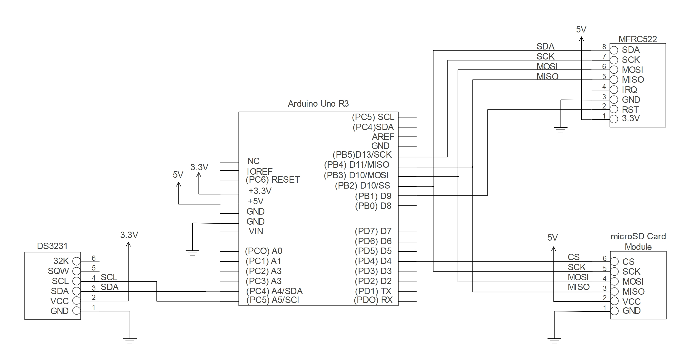

# RFID Attendance System GUI

## Introduction
Radio frequency identification (RFID) is a wireless technology that uses radio frequencies to scan and transmit data from a tag to a reader when the tagged object comes within the vicinity of the reader. This project explores the hardware and software implementation of RFID technology through a class attendance system to improve the efficiency and accuracy of traditional roll calls. The attendance system has three main functions: writing student names onto RFID tags, enrolling classes, and collecting attendance data. To implement these functions, the following low-cost hardware are used: an Arduino UNO R3 microcontroller is used to control and process serial data communication between passive RFID tags and a high-frequency MFRC522 reader module, a DS321 real-time clock module keeps the time with crystal oscillator frequencies and a MicroSD Card module logs the tag IDs and attendance information into text files. A C++ program is developed, and the compiled software is uploaded to the microcontroller using the Arduino IDE. A GUI is also developed with C# and Visual Studio to provide a user-friendly interface to control serial communication with RFIDs. 

## Table of Content
1. Circuit Configuration
2. Testing Arduino Code
3. Using Visual Studio Application
4. Sources & Credits

## Circuit Configuration
### Main Hardware
* Microcontroller: [Arduino Uno R3](https://store-usa.arduino.cc/products/arduino-uno-rev3?selectedStore=us)
* RFID Reader: [MFRC522 13.56 mHz](https://www.amazon.com/HiLetgo-RFID-Kit-Arduino-Raspberry/dp/B01CSTW0IA/ref=asc_df_B01CSTW0IA/?tag=hyprod-20&linkCode=df0&hvadid=647148730756&hvpos=&hvnetw=g&hvrand=2299663500531607591&hvpone=&hvptwo=&hvqmt=&hvdev=c&hvdvcmdl=&hvlocint=&hvlocphy=9011338&hvtargid=pla-1950968056071&psc=1&mcid=819ac2e9397239b78367e15d0470ee4c)
* Clock: [DS3231 AT24C32 IIC RTC Module](https://www.aliexpress.us/item/2261799820200166.html?src=google&src=google&albch=shopping&acnt=708-803-3821&slnk=&plac=&mtctp=&albbt=Google_7_shopping&albagn=888888&isSmbAutoCall=false&needSmbHouyi=false&albcp=19108228023&albag=&trgt=&crea=en2261799820200166&netw=x&device=c&albpg=&albpd=en2261799820200166&gad_source=1&gclid=Cj0KCQiAoKeuBhCoARIsAB4WxtdrzofVaCXFfQmMjPVoTNQcGn4AYoM1V-A-bqKsD6yy65BhFXuKE4saAj1kEALw_wcB&gclsrc=aw.ds&aff_fcid=2c5a9bb0e15c4953b32941e9b104da2d-1707762094803-09207-UneMJZVf&aff_fsk=UneMJZVf&aff_platform=aaf&sk=UneMJZVf&aff_trace_key=2c5a9bb0e15c4953b32941e9b104da2d-1707762094803-09207-UneMJZVf&terminal_id=b5f3c000951b4f69ae3bca0c1097b246&afSmartRedirect=y&gatewayAdapt=glo2usa) 
* SD Card Reader: [HiLetgo Micro SD TF Card Adater](https://www.amazon.com/HiLetgo-Adater-Interface-Conversion-Arduino/dp/B07BJ2P6X6/ref=asc_df_B07BJ2P6X6/?tag=hyprod-20&linkCode=df0&hvadid=647234334956&hvpos=&hvnetw=g&hvrand=8346166213057054374&hvpone=&hvptwo=&hvqmt=&hvdev=c&hvdvcmdl=&hvlocint=&hvlocphy=9011338&hvtargid=pla-1029287783408&psc=1&mcid=7acea16e6edc307ca62dcdd7a235a416) 
* RFID Tags: [MIFARE Classic 1k Cards](https://www.amazon.com/MIFARE-Classic-13-56MHZ-ISO14443A-Cards%EF%BC%8CPrintable/dp/B0BYMXQ6N6/ref=asc_df_B0BYMXQ6N6/?tag=hyprod-20&linkCode=df0&hvadid=658845669061&hvpos=&hvnetw=g&hvrand=3454618515796438384&hvpone=&hvptwo=&hvqmt=&hvdev=c&hvdvcmdl=&hvlocint=&hvlocphy=9011338&hvtargid=pla-2190838661518&psc=1&mcid=5db62084ed05340b8514e455a2cb33fb)

### External Components
* [Breadboard](https://www.amazon.com/BB400-Solderless-Plug-BreadBoard-tie-points/dp/B0040Z1ERO/ref=asc_df_B0040Z1ERO/?tag=hyprod-20&linkCode=df0&hvadid=241888066999&hvpos=&hvnetw=g&hvrand=11321113631732130181&hvpone=&hvptwo=&hvqmt=&hvdev=c&hvdvcmdl=&hvlocint=&hvlocphy=9011338&hvtargid=pla-638906394402&psc=1&mcid=4e0e4823951f3fb7826a5b4d621b724d&gclid=Cj0KCQiAoKeuBhCoARIsAB4WxtekmzXjbO3Uf9iHF_sJbHP3GQomFNULf6C3eE2ws1iyvJn03j3RcZUaAhx2EALw_wcB)
* [Dupont Wires](https://www.amazon.com/ELOOGAA-Multicolored-Breadboard-Compatible-Projects/dp/B0BGSFGSBJ/ref=asc_df_B0BGSFGSBJ/?tag=hyprod-20&linkCode=df0&hvadid=642064378071&hvpos=&hvnetw=g&hvrand=16008973895026062695&hvpone=&hvptwo=&hvqmt=&hvdev=c&hvdvcmdl=&hvlocint=&hvlocphy=9011338&hvtargid=pla-1952043365195&psc=1&mcid=5779511b629f39fe9b701b6aa015931b)
* [Micro SD Card and Adapter](https://www.amazon.com/SanDisk-Extreme-microSD-UHS-I-Adapter/dp/B07FCMBLV6/ref=asc_df_B07FCMBLV6/?tag=hyprod-20&linkCode=df0&hvadid=309776868400&hvpos=&hvnetw=g&hvrand=7565830546258457434&hvpone=&hvptwo=&hvqmt=&hvdev=c&hvdvcmdl=&hvlocint=&hvlocphy=9011338&hvtargid=pla-523573402313&psc=1&mcid=40272264ed6d35979ab0e3d33075fa62&gclid=Cj0KCQiAoKeuBhCoARIsAB4Wxte-mM4ryvI6kypSvLHujwtgdTsEpYsrYg4kFNQxKMdpS_ASbg--oyQaAiHwEALw_wcB)
* USB 2.0 Cable Type A/B (should be included with Arduino Uno R3)

### Circuit Pinout
Once you acquire all the required electrical components, wire all the devices together using the following pinout: 

| MFRC522 | DS3231 | SD Card Adater |
| --- | --- | --- |
| GND ---> GND | GND ---> GND | GND ---> GND |
| 3.3v ---> 3.3v | VCC ---> 5V | VCC ---> 5V |
| RST ---> 9 | SDA ---> A4 | MISO ---> 12 |
| SDA ---> 10 | SCL ---> A5 | MOSI ---> 11 |
| MOSI ---> 11  | | SCK ---> 13 |
| MISO ---> 12 | | CS ---> 4 |
| SCK ---> 13 |

The pinout depicts which pins on the electric components connect to the Arduino pins. The left label indicates the pin on the electrical device, while the right label indicates which pin to connect to on the Arduino. Several pins will need to be connected by a bread board to provide proper electrical current. The circuit layout should appear as follows:

## Testing Arduino Code 

### Uploading Code to Arduino 

Once the Arduino circuit is configured, download and setup the latest Arduino IDE version and download the attendanceSystem_guiEdition_v3 sketch from GitHub. Find and open the downloaded sketch, then search and download the two custom libraries by selecting the Manage Libraries option in the Tools tab: 
* MFRC522 by miguelbalboa
* RTClib by Adafruit

Once both libraries are downloaded, press the Verify icon (the checkmark) to compile the code. The status of the compilation should appear in the terminal at the bottom of the window. If the compilation fails, check to see if all the included libraries have been successfully installed and attempt to compile the code again. Once the code compiles, connect a USB 2.0 cable to the Arduino and your computer and select the Upload icon (the right arrow) next to the Verify icon. If the code successfully compiled, the code should upload to the Arduino with no issues.

### Main Functions

The Arduino code is divided into three main functions: 
* Writing/encoding names to RFID cards
* Registering RFID cards to classes
* Taking attendance of students in a class

To test each of the functions, connect the Arduino circuit to your computer using a USB cable. Compile and upload the writing test code to the Arduino. Ensure that the microSD card has been inserted in the SDCard moduel, then run the Serial Monitor under the Tools tab. Change the line ending settings to no new line. 

To activate the correct function, one of the following characters should be sent through the serial monitor:
* 'W': used to activate the writing function
* 'R': used to activate the registration function
* 'A': used to activate t he registration function

Once one of these characters has been sent, input the name of a class followed by the newline character, '\n'. **The name of the class must be no longer than 8 characters due to the formatting of folders on microSD cards**. A good format to follow for this is to use the prefix of a class and its number (ex: CS1302). If the class does not exist, a new folder will be created on the microSD card. Each folder contains a list of all the unique IDs, or UIDs, of registered cards and files of attendance for each day attendance was recorded. The following steps provide step-by-step examples of testing each of the three functions.

### Testing Write Functions
If the 'W' character is sent to test the write functions, place and hold one of the MIFARE cards on the RFID reader. Once initialization completes, write a person's first and last name into the serial monitor. Make sure to separate the names with a comma and end the name with the newline character '\n' (ex: John,Smith\n). A message should appear indicating whether the name was encoded to a given block of the card. Remove the card from the reader once this message has been displayed. If you would like to view the data on the card, use the test from miguelbalboa's DumpInfo test.

### Testing Registration Functions
If the 'R' character is sent to test the class registration functions, place and hold one of the MIFARE cards on the RFID reader. Once initialization completes, tap an unregistered MIFARE card onto the RFID reader. The program will search the class folder to see if the card's UID has been recorded. Since the current card is unregistered, the cards's UID will be added to the class registery. Once the card is registered, tap the same card on the reader again. The program should communicate that the card has already been registered. Evidence of this function can be viewed by removing the microSD card from the SDCard module, placing it in a microSDCard adapter, and inserting the adapter into your computer. Open the created class folder and review the contents of the UIDs.txt file to confirm the UID is present. Feel free to test this feature with other MIFARE cards and classes. 

### Testing Attendance Functions
If the 'A' character is sent to test the attendance functions, tap one of the MIFARE cards on the RFID reader. If the card is registered for the class, the monitor will display the card's UID, encoded name, and time of attendance. If the card is not registered, the serial monitor will suggest that the user should be registered once attendace is completed. Try the attendance feature with multiple cards. All the attendace data will be recorded in a designated text file on the microSD card for that day. 

## Using Visual Studio Application

### Cloning Repository
The main GUI of the project is operable in Visual Studio. To access the project, open Visual Studio and select the Clone Repository option. Paste the GitHub URL and follow the instructions to successfully clone the repository. Once the repository has been successfully cloned, run the project. When the code compiles and runs, a window will appear that displays two panels: the Setup bar and the Instruction panel. 

### Instruction Panel and Setup Bar
The Instruction panel contains interactive instructions for utilizing each of the three features using the application. Selecting each of the intstruction buttons reveals a step-by-step guide for successfully using each of the functions. The Setup bar is used to configure serial communication between the Arduino circuit and the application. The following explains how to use the Setup Bar:

* Select the serial port that appears when your Arduino circuit is connected to your computer.
* Select the appropriate baud rate.
* Input a class name and the RFID function.
* Select the Connect button to begin serial communication.

### Using Application and Data
Once serial communication begins, the Instructions panel will switch to the panel of the selected RFID function. Follow the instructions provided on the Instruction Panel and use the application as intended Once the desired operations are complete, select the Disconnect function to end serial communication. Before reconnecting with another RFID function, ** reset the Arduino by pressing the red Reset button on the Arduino microcontroller**. Change settings and RFID functions if desired on the Setup bar, and reconnect the application. Repeat these actions to utilize all the functions the application has to desire. To view the attendance records, remove the microSD card from the sdCard module and insert it into a microSD adapter. Insert the device, locate the drive, and search the desired class folder to find records of stored UIDs and attendance records.

## Sources and Credits
For a more in-depth review of the intricacies of the development of this attendance system, review the following article: [Digital Attendance: The Design of an RFID-based Attendance System](https://issuu.com/vsuenglish/docs/volume_13?fr=xKAE9_zU1NQ) (starts on pg. 90).
